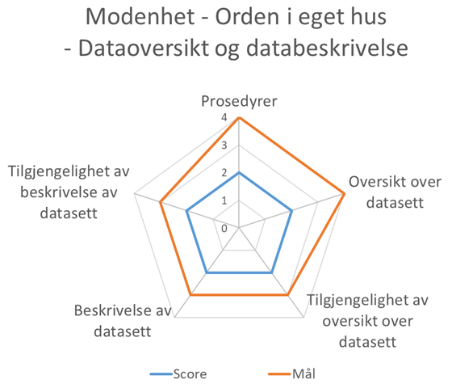

== Om modenhetsmodellen [[om-modenhetsmodellen]]
Denne modenhetsmodellen legger hovedvekt på de overordnede aspekter ved å ha oversikt over egne datasett. Modellen legger vekt på i hvilken grad, framfor hvordan, en gitt ønsket tilstand (egenskap) er oppnådd. Vi foreslår også å ta med få egenskaper/akser i denne modellen, og heller utvide modellen med flere egenskaper senere (ev. flere og mer detaljerte scoremuligheter). Egenskapene vi konsentrer oss om i første omgang, er de som er viktige for å fremme gjenbruk/viderebruk av data (oversikt over og beskrivelse av datasett, og tilgjengeliggjøring av oversikten/beskrivelsen). Modellen har derfor også fått under-/versjonstittelen «orden i eget hus - oversikt over og beskrivelse av egne datasett». I og med at omfanget av vurderingskriteriene begrenses, er det viktige sider ved informasjonsforvaltning som ikke måles i denne modellen. Et eksempel er tjenesteutvikling. Vi har valgt å utelate dette området i første omgang fordi tjenesteutvikling de siste årene heller har dreid seg om «å sette strøm på papir», enn gjenbruk av data - selv om det finnes gode eksempler også på gjenbrukstjenester. Difi gjennomfører dessuten egne undersøkelser på området, bl.a. https://www.digdir.no/digitalisering-og-samordning/digitale-tenester-i-staten-statuskartlegging/1374[Digitale tenester i staten - ei statuskartlegging  &#x29C9;, window="_blank", role="ext-link"]. 
 
Modenhetsmodellen er utformet på følgende måte:  

*	Hver akse i modenhetsmodellen uttrykker en gitt ønsket egenskap.  
** Egenskapene/aksene er forsøkt utformet uavhengig av hverandre. Det er noe avhengig mellom noen av aksene, som vil bli kommentert nedenfor i <<bruksanvisning, Bruksanvisningen>>.  

*	Scorene langs den enkelte aksen uttrykker ulik grad av å inneha den aktuelle egenskapen.  
** Det er et mål at enhver virksomhet, uansett størrelse og oppgaveart, (over tid) skal kunne ha den høyeste score langs alle akser i denne modenhetsmodellen. 

*	Scorene langs de ulike aksene til sammen uttrykker den totale modenheten til en virksomhet. Scorene langs de ulike aksene skal ikke summeres eller lages gjennomsnitt av.  
 
Se illustrasjonen nedenfor. 

[[figur-illustrasjon-av-modenhetsmodellen]]
.Illustrasjon av modenhetsmodellen. 
[link=images/illustrasjon-av-modenhetsmodellen.png]
